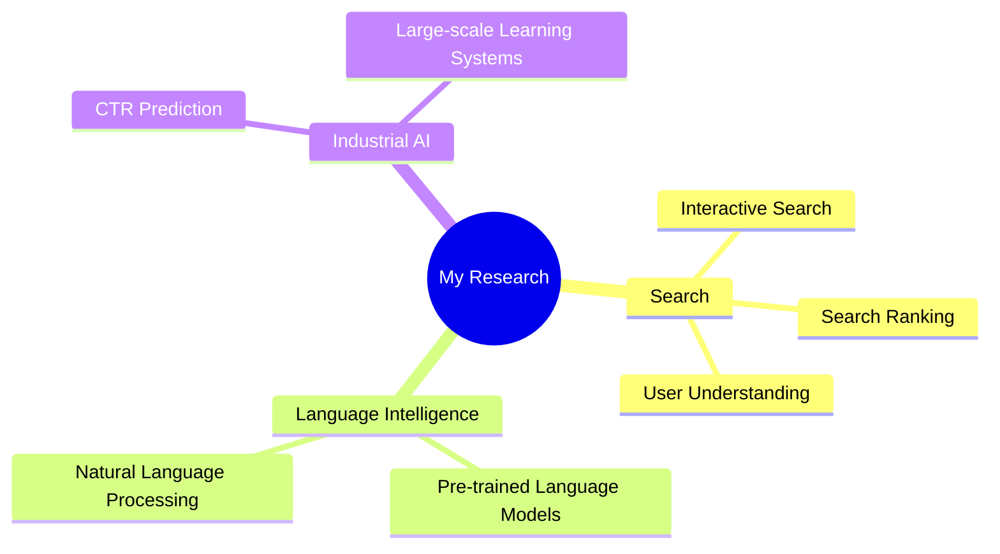

<!-- Animated header -->
<div align="center">


[](https://git.io/typing-svg)

<p>
  
  
  
</p>

</div>

## 👋 About Me

I am currently leading the **Search Algorithm Team at Meituan Keeta**, building intelligent search systems that connect users with exactly what they need.

Before that, I served as the **POC of the CTR Prediction Team** in the **Search Division at Xiaohongshu (RED)**. Earlier, I received my **Ph.D. from THUIR**, Department of Computer Science and Technology, **Tsinghua University**.

```text
Meituan Keeta       ──  Search Algorithm Team Lead
       ▲
Xiaohongshu Search ──  CTR Prediction Team POC
       ▲
Tsinghua University ─  Ph.D. @ THUIR
```

## 🔬 Research Interests



## 🎓 Academic Service

I have served as a **PC member and reviewer** for leading IR, NLP, and AI conferences and journals, including:

<div align="center">


</div>

## 🎧 Beyond Research

When I am not tuning ranking models or exploring the next frontier of search, you will probably find me immersed in **popular music, comics, and anime**.

> Naruto · Inuyasha · Saint Seiya · A Certain Scientific Railgun · Demon Slayer  
> Detective Conan · Howl’s Moving Castle · Digimon Adventure · Pokémon

<div align="center">

### ⚡ Everybody loves Misaka Mikoto, Uchiha Itachi, Kikyo & Sesshoumaru! ⚡

```text
「The future belongs to those who believe in the beauty of their dreams.」
```


</div>
